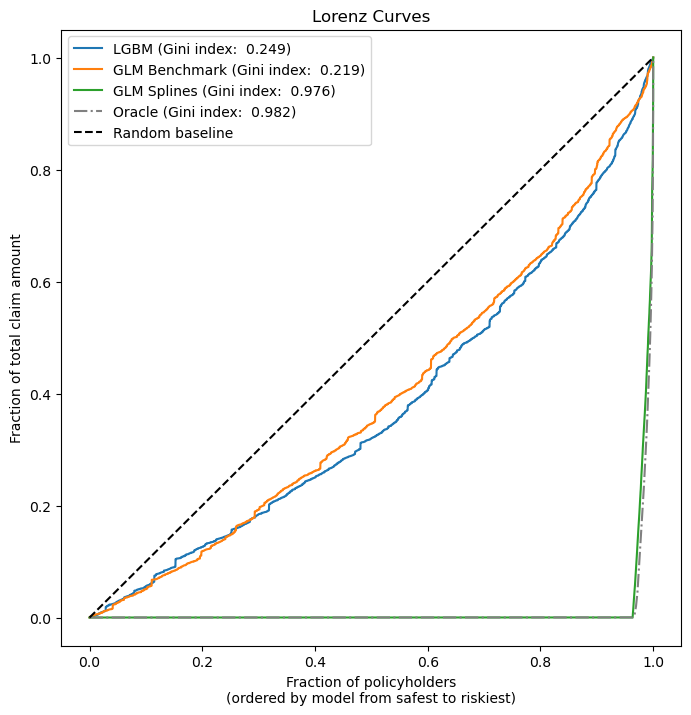

# Problem Set 3: Claims modelling exercise
Group 3:
- Benjamin Brückner
- Jamal Lawal
- Mengcheng Zhang
- Haoyuan Jia

The following repo contains the code/solutions to PS3, D100.

Initialise the environment:
```
conda env create -f environment.yml
conda activate ps3
pip install --no-build-isolation -e .
```

The solution for exercise 3 is directly appended below.


## Exercise 3: Feature Engineering and Modelling

Group 3:
- Benjamin Brückner
- Jamal Lawal
- Mengcheng Zhang
- Haoyuan Jia

The following notebook contains the code/solutions to exercise 3, PS3, D100.

First, we import all our modules.


```python
# Import all modules
import matplotlib.pyplot as plt
import numpy as np
import pandas as pd
from dask_ml.preprocessing import Categorizer
from glum import GeneralizedLinearRegressor, TweedieDistribution
from lightgbm import LGBMRegressor
from sklearn.compose import ColumnTransformer
from sklearn.metrics import auc
from sklearn.model_selection import GridSearchCV
from sklearn.pipeline import Pipeline
from sklearn.preprocessing import OneHotEncoder, SplineTransformer, StandardScaler
import os
import sys
sys.path.append(os.path.abspath(os.path.join(os.getcwd(), '..')))
from ps3.data import create_sample_split, load_transform
```

Then, we load the data to work with.


```python
# load data
df = load_transform()
print(df.describe())
```

                  IDpol        ClaimNb       Exposure       VehPower  \
    count  6.780130e+05  678013.000000  678013.000000  678013.000000   
    mean   2.621857e+06       0.038946       0.528545       6.255635   
    std    1.641783e+06       0.205036       0.364081       1.603689   
    min    1.000000e+00       0.000000       0.002732       4.000000   
    25%    1.157951e+06       0.000000       0.180000       5.000000   
    50%    2.272152e+06       0.000000       0.490000       6.000000   
    75%    4.046274e+06       0.000000       0.990000       7.000000   
    max    6.114330e+06       4.000000       1.000000       9.000000   
    
                  VehAge        DrivAge     BonusMalus        Density  \
    count  678013.000000  678013.000000  678013.000000  678013.000000   
    mean        1.188850       3.782926      59.761502    1792.422405   
    std         0.568775       1.304976      15.636658    3958.646564   
    min         0.000000       0.000000      50.000000       1.000000   
    25%         1.000000       3.000000      50.000000      92.000000   
    50%         1.000000       4.000000      50.000000     393.000000   
    75%         2.000000       5.000000      64.000000    1658.000000   
    max         2.000000       6.000000     230.000000   27000.000000   
    
            ClaimAmount  ClaimAmountCut  
    count  6.780130e+05   678013.000000  
    mean   8.835998e+01       72.715709  
    std    5.822454e+03     1171.681571  
    min    0.000000e+00        0.000000  
    25%    0.000000e+00        0.000000  
    50%    0.000000e+00        0.000000  
    75%    0.000000e+00        0.000000  
    max    4.075401e+06   115600.000000  


```python
# Train benchmark tweedie model. This is entirely based on the glum tutorial.
weight = df["Exposure"].values
df["PurePremium"] = df["ClaimAmountCut"] / df["Exposure"]
y = df["PurePremium"]
# Print a summary of y
print(y.describe())
```

    count    6.780130e+05
    mean     3.090581e+02
    std      1.806476e+04
    min      0.000000e+00
    25%      0.000000e+00
    50%      0.000000e+00
    75%      0.000000e+00
    max      1.000000e+07
    Name: PurePremium, dtype: float64


**Why do you think, we divide by exposure here to arrive at our outcome variable?**

We divide by the outcome variable `Exposure` as a longer exposure time makes accidents (and therefore claims) more likely. Therefore, we prefer to measure the claim amount over time than simply the total claim amount per policy.


```python
# We use our create_sample_split function here to split the data into train and test
df = create_sample_split(df, 0.8)
train = np.where(df["sample"] == "train")
test = np.where(df["sample"] == "test")
df_train = df.iloc[train].copy()
df_test = df.iloc[test].copy()
print("Training Data (%): ", df_train.shape[0] / df.shape[0])
print("Test Data (%): ", df_test.shape[0] / df.shape[0])
print("Total Number of Observations: ", df.shape[0])
```

    Training Data (%):  0.7999713869793057
    Test Data (%):  0.2000286130206943
    Total Number of Observations:  678013


```python
# Benchmark Model

categoricals = ["VehBrand", "VehGas", "Region", "Area", "DrivAge", "VehAge", "VehPower"]

predictors = categoricals + ["BonusMalus", "Density"]
glm_categorizer = Categorizer(columns=categoricals)

X_train_t = glm_categorizer.fit_transform(df[predictors].iloc[train])
X_test_t = glm_categorizer.transform(df[predictors].iloc[test])
y_train_t, y_test_t = y.iloc[train], y.iloc[test]
w_train_t, w_test_t = weight[train], weight[test]

TweedieDist = TweedieDistribution(1.5)
t_glm1 = GeneralizedLinearRegressor(family=TweedieDist, l1_ratio=1, fit_intercept=True)
t_glm1.fit(X_train_t, y_train_t, sample_weight=w_train_t)


pd.DataFrame(
    {"coefficient": np.concatenate(([t_glm1.intercept_], t_glm1.coef_))},
    index=["intercept"] + t_glm1.feature_names_,
).T

df_test["pp_t_glm1"] = t_glm1.predict(X_test_t)
df_train["pp_t_glm1"] = t_glm1.predict(X_train_t)

print(
    "training loss t_glm1:  {}".format(
        TweedieDist.deviance(y_train_t, df_train["pp_t_glm1"], sample_weight=w_train_t)
        / np.sum(w_train_t)
    )
)

print(
    "testing loss t_glm1:  {}".format(
        TweedieDist.deviance(y_test_t, df_test["pp_t_glm1"], sample_weight=w_test_t)
        / np.sum(w_test_t)
    )
)

print(
    "Total claim amount on test set, observed = {}, predicted = {}".format(
        df["ClaimAmountCut"].values[test].sum(),
        np.sum(df["Exposure"].values[test] * t_glm1.predict(X_test_t)),
    )
)
```

    training loss t_glm1:  73.88055076671286
    testing loss t_glm1:  73.21798559441893
    Total claim amount on test set, observed = 9439528.910000002, predicted = 10073636.959900277


## Let's add splines for BonusMalus and Density and use a Pipeline.
Steps: 
1. Define a Pipeline which chains a StandardScaler and SplineTransformer. Choose knots="quantile" for the SplineTransformer and make sure, we are only including one intercept in the final GLM. 

2. Put the transforms together into a ColumnTransformer. Here we use OneHotEncoder for the categoricals.

3. Chain the transforms together with the GLM in a Pipeline.


```python
# Let's put together a pipeline
numeric_cols = ["BonusMalus", "Density"]


spline_pipe = Pipeline([
    ('scaler', StandardScaler()),
    ('spline', SplineTransformer(
        n_knots=5,
        degree=3,
        knots='quantile',
        include_bias=False  # Ensure we only have one intercept in final GLM
    ))
])

preprocessor = ColumnTransformer(
    transformers=[
        ('splines', spline_pipe, numeric_cols),
        ("cat", OneHotEncoder(sparse_output=False, drop="first"), categoricals)
    ],
    remainder='passthrough'  # Pass through any other columns unchanged
)
preprocessor.set_output(transform="pandas")

model_pipeline = Pipeline([
    ('preprocessor', preprocessor),
    ('glm', GeneralizedLinearRegressor(family='tweedie', l1_ratio=1))
])

model_pipeline

# checking that the transforms worked
model_pipeline[:-1].fit_transform(df_train)

model_pipeline.fit(df_train, y_train_t, glm__sample_weight=w_train_t)
```

    /Users/benjamin/opt/anaconda3/envs/ps3/lib/python3.12/site-packages/tabmat/constructor.py:172: UserWarning: Columns ['remainder__sample'] were ignored. Make sure they have a valid dtype.
      warnings.warn(
    /Users/benjamin/opt/anaconda3/envs/ps3/lib/python3.12/site-packages/glum/_solvers.py:58: ConvergenceWarning: Coordinate descent did not converge. You might want to increase the number of iterations. Minimum norm subgradient: 0.000231504704753185, tolerance: 0.00016544567912902245
      new_coef, gap, _, _, n_cycles = enet_coordinate_descent_gram(
    /Users/benjamin/opt/anaconda3/envs/ps3/lib/python3.12/site-packages/glum/_solvers.py:58: ConvergenceWarning: Coordinate descent did not converge. You might want to increase the number of iterations. Minimum norm subgradient: 0.00016081753725487904, tolerance: 0.0001
      new_coef, gap, _, _, n_cycles = enet_coordinate_descent_gram(
    /Users/benjamin/opt/anaconda3/envs/ps3/lib/python3.12/site-packages/glum/_solvers.py:58: ConvergenceWarning: Coordinate descent did not converge. You might want to increase the number of iterations. Minimum norm subgradient: 0.00012359480662727876, tolerance: 0.0001
      new_coef, gap, _, _, n_cycles = enet_coordinate_descent_gram(
    /Users/benjamin/opt/anaconda3/envs/ps3/lib/python3.12/site-packages/sklearn/compose/_column_transformer.py:1623: FutureWarning: 
    The format of the columns of the 'remainder' transformer in ColumnTransformer.transformers_ will change in version 1.7 to match the format of the other transformers.
    At the moment the remainder columns are stored as indices (of type int). With the same ColumnTransformer configuration, in the future they will be stored as column names (of type str).
    To use the new behavior now and suppress this warning, use ColumnTransformer(force_int_remainder_cols=False).
    
      warnings.warn(


<style>#sk-container-id-2 {
  /* Definition of color scheme common for light and dark mode */
  --sklearn-color-text: black;
  --sklearn-color-line: gray;
  /* Definition of color scheme for unfitted estimators */
  --sklearn-color-unfitted-level-0: #fff5e6;
  --sklearn-color-unfitted-level-1: #f6e4d2;
  --sklearn-color-unfitted-level-2: #ffe0b3;
  --sklearn-color-unfitted-level-3: chocolate;
  /* Definition of color scheme for fitted estimators */
  --sklearn-color-fitted-level-0: #f0f8ff;
  --sklearn-color-fitted-level-1: #d4ebff;
  --sklearn-color-fitted-level-2: #b3dbfd;
  --sklearn-color-fitted-level-3: cornflowerblue;

  /* Specific color for light theme */
  --sklearn-color-text-on-default-background: var(--sg-text-color, var(--theme-code-foreground, var(--jp-content-font-color1, black)));
  --sklearn-color-background: var(--sg-background-color, var(--theme-background, var(--jp-layout-color0, white)));
  --sklearn-color-border-box: var(--sg-text-color, var(--theme-code-foreground, var(--jp-content-font-color1, black)));
  --sklearn-color-icon: #696969;

  @media (prefers-color-scheme: dark) {
    /* Redefinition of color scheme for dark theme */
    --sklearn-color-text-on-default-background: var(--sg-text-color, var(--theme-code-foreground, var(--jp-content-font-color1, white)));
    --sklearn-color-background: var(--sg-background-color, var(--theme-background, var(--jp-layout-color0, #111)));
    --sklearn-color-border-box: var(--sg-text-color, var(--theme-code-foreground, var(--jp-content-font-color1, white)));
    --sklearn-color-icon: #878787;
  }
}

#sk-container-id-2 {
  color: var(--sklearn-color-text);
}

#sk-container-id-2 pre {
  padding: 0;
}

#sk-container-id-2 input.sk-hidden--visually {
  border: 0;
  clip: rect(1px 1px 1px 1px);
  clip: rect(1px, 1px, 1px, 1px);
  height: 1px;
  margin: -1px;
  overflow: hidden;
  padding: 0;
  position: absolute;
  width: 1px;
}

#sk-container-id-2 div.sk-dashed-wrapped {
  border: 1px dashed var(--sklearn-color-line);
  margin: 0 0.4em 0.5em 0.4em;
  box-sizing: border-box;
  padding-bottom: 0.4em;
  background-color: var(--sklearn-color-background);
}

#sk-container-id-2 div.sk-container {
  /* jupyter's `normalize.less` sets `[hidden] { display: none; }`
     but bootstrap.min.css set `[hidden] { display: none !important; }`
     so we also need the `!important` here to be able to override the
     default hidden behavior on the sphinx rendered scikit-learn.org.
     See: https://github.com/scikit-learn/scikit-learn/issues/21755 */
  display: inline-block !important;
  position: relative;
}

#sk-container-id-2 div.sk-text-repr-fallback {
  display: none;
}

div.sk-parallel-item,
div.sk-serial,
div.sk-item {
  /* draw centered vertical line to link estimators */
  background-image: linear-gradient(var(--sklearn-color-text-on-default-background), var(--sklearn-color-text-on-default-background));
  background-size: 2px 100%;
  background-repeat: no-repeat;
  background-position: center center;
}

/* Parallel-specific style estimator block */

#sk-container-id-2 div.sk-parallel-item::after {
  content: "";
  width: 100%;
  border-bottom: 2px solid var(--sklearn-color-text-on-default-background);
  flex-grow: 1;
}

#sk-container-id-2 div.sk-parallel {
  display: flex;
  align-items: stretch;
  justify-content: center;
  background-color: var(--sklearn-color-background);
  position: relative;
}

#sk-container-id-2 div.sk-parallel-item {
  display: flex;
  flex-direction: column;
}

#sk-container-id-2 div.sk-parallel-item:first-child::after {
  align-self: flex-end;
  width: 50%;
}

#sk-container-id-2 div.sk-parallel-item:last-child::after {
  align-self: flex-start;
  width: 50%;
}

#sk-container-id-2 div.sk-parallel-item:only-child::after {
  width: 0;
}

/* Serial-specific style estimator block */

#sk-container-id-2 div.sk-serial {
  display: flex;
  flex-direction: column;
  align-items: center;
  background-color: var(--sklearn-color-background);
  padding-right: 1em;
  padding-left: 1em;
}


/* Toggleable style: style used for estimator/Pipeline/ColumnTransformer box that is
clickable and can be expanded/collapsed.
- Pipeline and ColumnTransformer use this feature and define the default style
- Estimators will overwrite some part of the style using the `sk-estimator` class
*/

/* Pipeline and ColumnTransformer style (default) */

#sk-container-id-2 div.sk-toggleable {
  /* Default theme specific background. It is overwritten whether we have a
  specific estimator or a Pipeline/ColumnTransformer */
  background-color: var(--sklearn-color-background);
}

/* Toggleable label */
#sk-container-id-2 label.sk-toggleable__label {
  cursor: pointer;
  display: block;
  width: 100%;
  margin-bottom: 0;
  padding: 0.5em;
  box-sizing: border-box;
  text-align: center;
}

#sk-container-id-2 label.sk-toggleable__label-arrow:before {
  /* Arrow on the left of the label */
  content: "▸";
  float: left;
  margin-right: 0.25em;
  color: var(--sklearn-color-icon);
}

#sk-container-id-2 label.sk-toggleable__label-arrow:hover:before {
  color: var(--sklearn-color-text);
}

/* Toggleable content - dropdown */

#sk-container-id-2 div.sk-toggleable__content {
  max-height: 0;
  max-width: 0;
  overflow: hidden;
  text-align: left;
  /* unfitted */
  background-color: var(--sklearn-color-unfitted-level-0);
}

#sk-container-id-2 div.sk-toggleable__content.fitted {
  /* fitted */
  background-color: var(--sklearn-color-fitted-level-0);
}

#sk-container-id-2 div.sk-toggleable__content pre {
  margin: 0.2em;
  border-radius: 0.25em;
  color: var(--sklearn-color-text);
  /* unfitted */
  background-color: var(--sklearn-color-unfitted-level-0);
}

#sk-container-id-2 div.sk-toggleable__content.fitted pre {
  /* unfitted */
  background-color: var(--sklearn-color-fitted-level-0);
}

#sk-container-id-2 input.sk-toggleable__control:checked~div.sk-toggleable__content {
  /* Expand drop-down */
  max-height: 200px;
  max-width: 100%;
  overflow: auto;
}

#sk-container-id-2 input.sk-toggleable__control:checked~label.sk-toggleable__label-arrow:before {
  content: "▾";
}

/* Pipeline/ColumnTransformer-specific style */

#sk-container-id-2 div.sk-label input.sk-toggleable__control:checked~label.sk-toggleable__label {
  color: var(--sklearn-color-text);
  background-color: var(--sklearn-color-unfitted-level-2);
}

#sk-container-id-2 div.sk-label.fitted input.sk-toggleable__control:checked~label.sk-toggleable__label {
  background-color: var(--sklearn-color-fitted-level-2);
}

/* Estimator-specific style */

/* Colorize estimator box */
#sk-container-id-2 div.sk-estimator input.sk-toggleable__control:checked~label.sk-toggleable__label {
  /* unfitted */
  background-color: var(--sklearn-color-unfitted-level-2);
}

#sk-container-id-2 div.sk-estimator.fitted input.sk-toggleable__control:checked~label.sk-toggleable__label {
  /* fitted */
  background-color: var(--sklearn-color-fitted-level-2);
}

#sk-container-id-2 div.sk-label label.sk-toggleable__label,
#sk-container-id-2 div.sk-label label {
  /* The background is the default theme color */
  color: var(--sklearn-color-text-on-default-background);
}

/* On hover, darken the color of the background */
#sk-container-id-2 div.sk-label:hover label.sk-toggleable__label {
  color: var(--sklearn-color-text);
  background-color: var(--sklearn-color-unfitted-level-2);
}

/* Label box, darken color on hover, fitted */
#sk-container-id-2 div.sk-label.fitted:hover label.sk-toggleable__label.fitted {
  color: var(--sklearn-color-text);
  background-color: var(--sklearn-color-fitted-level-2);
}

/* Estimator label */

#sk-container-id-2 div.sk-label label {
  font-family: monospace;
  font-weight: bold;
  display: inline-block;
  line-height: 1.2em;
}

#sk-container-id-2 div.sk-label-container {
  text-align: center;
}

/* Estimator-specific */
#sk-container-id-2 div.sk-estimator {
  font-family: monospace;
  border: 1px dotted var(--sklearn-color-border-box);
  border-radius: 0.25em;
  box-sizing: border-box;
  margin-bottom: 0.5em;
  /* unfitted */
  background-color: var(--sklearn-color-unfitted-level-0);
}

#sk-container-id-2 div.sk-estimator.fitted {
  /* fitted */
  background-color: var(--sklearn-color-fitted-level-0);
}

/* on hover */
#sk-container-id-2 div.sk-estimator:hover {
  /* unfitted */
  background-color: var(--sklearn-color-unfitted-level-2);
}

#sk-container-id-2 div.sk-estimator.fitted:hover {
  /* fitted */
  background-color: var(--sklearn-color-fitted-level-2);
}

/* Specification for estimator info (e.g. "i" and "?") */

/* Common style for "i" and "?" */

.sk-estimator-doc-link,
a:link.sk-estimator-doc-link,
a:visited.sk-estimator-doc-link {
  float: right;
  font-size: smaller;
  line-height: 1em;
  font-family: monospace;
  background-color: var(--sklearn-color-background);
  border-radius: 1em;
  height: 1em;
  width: 1em;
  text-decoration: none !important;
  margin-left: 1ex;
  /* unfitted */
  border: var(--sklearn-color-unfitted-level-1) 1pt solid;
  color: var(--sklearn-color-unfitted-level-1);
}

.sk-estimator-doc-link.fitted,
a:link.sk-estimator-doc-link.fitted,
a:visited.sk-estimator-doc-link.fitted {
  /* fitted */
  border: var(--sklearn-color-fitted-level-1) 1pt solid;
  color: var(--sklearn-color-fitted-level-1);
}

/* On hover */
div.sk-estimator:hover .sk-estimator-doc-link:hover,
.sk-estimator-doc-link:hover,
div.sk-label-container:hover .sk-estimator-doc-link:hover,
.sk-estimator-doc-link:hover {
  /* unfitted */
  background-color: var(--sklearn-color-unfitted-level-3);
  color: var(--sklearn-color-background);
  text-decoration: none;
}

div.sk-estimator.fitted:hover .sk-estimator-doc-link.fitted:hover,
.sk-estimator-doc-link.fitted:hover,
div.sk-label-container:hover .sk-estimator-doc-link.fitted:hover,
.sk-estimator-doc-link.fitted:hover {
  /* fitted */
  background-color: var(--sklearn-color-fitted-level-3);
  color: var(--sklearn-color-background);
  text-decoration: none;
}

/* Span, style for the box shown on hovering the info icon */
.sk-estimator-doc-link span {
  display: none;
  z-index: 9999;
  position: relative;
  font-weight: normal;
  right: .2ex;
  padding: .5ex;
  margin: .5ex;
  width: min-content;
  min-width: 20ex;
  max-width: 50ex;
  color: var(--sklearn-color-text);
  box-shadow: 2pt 2pt 4pt #999;
  /* unfitted */
  background: var(--sklearn-color-unfitted-level-0);
  border: .5pt solid var(--sklearn-color-unfitted-level-3);
}

.sk-estimator-doc-link.fitted span {
  /* fitted */
  background: var(--sklearn-color-fitted-level-0);
  border: var(--sklearn-color-fitted-level-3);
}

.sk-estimator-doc-link:hover span {
  display: block;
}

/* "?"-specific style due to the `<a>` HTML tag */

#sk-container-id-2 a.estimator_doc_link {
  float: right;
  font-size: 1rem;
  line-height: 1em;
  font-family: monospace;
  background-color: var(--sklearn-color-background);
  border-radius: 1rem;
  height: 1rem;
  width: 1rem;
  text-decoration: none;
  /* unfitted */
  color: var(--sklearn-color-unfitted-level-1);
  border: var(--sklearn-color-unfitted-level-1) 1pt solid;
}

#sk-container-id-2 a.estimator_doc_link.fitted {
  /* fitted */
  border: var(--sklearn-color-fitted-level-1) 1pt solid;
  color: var(--sklearn-color-fitted-level-1);
}

/* On hover */
#sk-container-id-2 a.estimator_doc_link:hover {
  /* unfitted */
  background-color: var(--sklearn-color-unfitted-level-3);
  color: var(--sklearn-color-background);
  text-decoration: none;
}

#sk-container-id-2 a.estimator_doc_link.fitted:hover {
  /* fitted */
  background-color: var(--sklearn-color-fitted-level-3);
}
</style><div id="sk-container-id-2" class="sk-top-container"><div class="sk-text-repr-fallback"><pre>Pipeline(steps=[(&#x27;preprocessor&#x27;,
                 ColumnTransformer(remainder=&#x27;passthrough&#x27;,
                                   transformers=[(&#x27;splines&#x27;,
                                                  Pipeline(steps=[(&#x27;scaler&#x27;,
                                                                   StandardScaler()),
                                                                  (&#x27;spline&#x27;,
                                                                   SplineTransformer(include_bias=False,
                                                                                     knots=&#x27;quantile&#x27;))]),
                                                  [&#x27;BonusMalus&#x27;, &#x27;Density&#x27;]),
                                                 (&#x27;cat&#x27;,
                                                  OneHotEncoder(drop=&#x27;first&#x27;,
                                                                sparse_output=False),
                                                  [&#x27;VehBrand&#x27;, &#x27;VehGas&#x27;,
                                                   &#x27;Region&#x27;, &#x27;Area&#x27;, &#x27;DrivAge&#x27;,
                                                   &#x27;VehAge&#x27;, &#x27;VehPower&#x27;])])),
                (&#x27;glm&#x27;,
                 GeneralizedLinearRegressor(family=&#x27;tweedie&#x27;, l1_ratio=1))])</pre><b>In a Jupyter environment, please rerun this cell to show the HTML representation or trust the notebook. <br />On GitHub, the HTML representation is unable to render, please try loading this page with nbviewer.org.</b></div><div class="sk-container" hidden><div class="sk-item sk-dashed-wrapped"><div class="sk-label-container"><div class="sk-label fitted sk-toggleable"><input class="sk-toggleable__control sk-hidden--visually" id="sk-estimator-id-11" type="checkbox" ><label for="sk-estimator-id-11" class="sk-toggleable__label fitted sk-toggleable__label-arrow fitted">&nbsp;&nbsp;Pipeline<a class="sk-estimator-doc-link fitted" rel="noreferrer" target="_blank" href="https://scikit-learn.org/1.5/modules/generated/sklearn.pipeline.Pipeline.html">?<span>Documentation for Pipeline</span></a><span class="sk-estimator-doc-link fitted">i<span>Fitted</span></span></label><div class="sk-toggleable__content fitted"><pre>Pipeline(steps=[(&#x27;preprocessor&#x27;,
                 ColumnTransformer(remainder=&#x27;passthrough&#x27;,
                                   transformers=[(&#x27;splines&#x27;,
                                                  Pipeline(steps=[(&#x27;scaler&#x27;,
                                                                   StandardScaler()),
                                                                  (&#x27;spline&#x27;,
                                                                   SplineTransformer(include_bias=False,
                                                                                     knots=&#x27;quantile&#x27;))]),
                                                  [&#x27;BonusMalus&#x27;, &#x27;Density&#x27;]),
                                                 (&#x27;cat&#x27;,
                                                  OneHotEncoder(drop=&#x27;first&#x27;,
                                                                sparse_output=False),
                                                  [&#x27;VehBrand&#x27;, &#x27;VehGas&#x27;,
                                                   &#x27;Region&#x27;, &#x27;Area&#x27;, &#x27;DrivAge&#x27;,
                                                   &#x27;VehAge&#x27;, &#x27;VehPower&#x27;])])),
                (&#x27;glm&#x27;,
                 GeneralizedLinearRegressor(family=&#x27;tweedie&#x27;, l1_ratio=1))])</pre></div> </div></div><div class="sk-serial"><div class="sk-item sk-dashed-wrapped"><div class="sk-label-container"><div class="sk-label fitted sk-toggleable"><input class="sk-toggleable__control sk-hidden--visually" id="sk-estimator-id-12" type="checkbox" ><label for="sk-estimator-id-12" class="sk-toggleable__label fitted sk-toggleable__label-arrow fitted">&nbsp;preprocessor: ColumnTransformer<a class="sk-estimator-doc-link fitted" rel="noreferrer" target="_blank" href="https://scikit-learn.org/1.5/modules/generated/sklearn.compose.ColumnTransformer.html">?<span>Documentation for preprocessor: ColumnTransformer</span></a></label><div class="sk-toggleable__content fitted"><pre>ColumnTransformer(remainder=&#x27;passthrough&#x27;,
                  transformers=[(&#x27;splines&#x27;,
                                 Pipeline(steps=[(&#x27;scaler&#x27;, StandardScaler()),
                                                 (&#x27;spline&#x27;,
                                                  SplineTransformer(include_bias=False,
                                                                    knots=&#x27;quantile&#x27;))]),
                                 [&#x27;BonusMalus&#x27;, &#x27;Density&#x27;]),
                                (&#x27;cat&#x27;,
                                 OneHotEncoder(drop=&#x27;first&#x27;,
                                               sparse_output=False),
                                 [&#x27;VehBrand&#x27;, &#x27;VehGas&#x27;, &#x27;Region&#x27;, &#x27;Area&#x27;,
                                  &#x27;DrivAge&#x27;, &#x27;VehAge&#x27;, &#x27;VehPower&#x27;])])</pre></div> </div></div><div class="sk-parallel"><div class="sk-parallel-item"><div class="sk-item"><div class="sk-label-container"><div class="sk-label fitted sk-toggleable"><input class="sk-toggleable__control sk-hidden--visually" id="sk-estimator-id-13" type="checkbox" ><label for="sk-estimator-id-13" class="sk-toggleable__label fitted sk-toggleable__label-arrow fitted">splines</label><div class="sk-toggleable__content fitted"><pre>[&#x27;BonusMalus&#x27;, &#x27;Density&#x27;]</pre></div> </div></div><div class="sk-serial"><div class="sk-item"><div class="sk-serial"><div class="sk-item"><div class="sk-estimator fitted sk-toggleable"><input class="sk-toggleable__control sk-hidden--visually" id="sk-estimator-id-14" type="checkbox" ><label for="sk-estimator-id-14" class="sk-toggleable__label fitted sk-toggleable__label-arrow fitted">&nbsp;StandardScaler<a class="sk-estimator-doc-link fitted" rel="noreferrer" target="_blank" href="https://scikit-learn.org/1.5/modules/generated/sklearn.preprocessing.StandardScaler.html">?<span>Documentation for StandardScaler</span></a></label><div class="sk-toggleable__content fitted"><pre>StandardScaler()</pre></div> </div></div><div class="sk-item"><div class="sk-estimator fitted sk-toggleable"><input class="sk-toggleable__control sk-hidden--visually" id="sk-estimator-id-15" type="checkbox" ><label for="sk-estimator-id-15" class="sk-toggleable__label fitted sk-toggleable__label-arrow fitted">&nbsp;SplineTransformer<a class="sk-estimator-doc-link fitted" rel="noreferrer" target="_blank" href="https://scikit-learn.org/1.5/modules/generated/sklearn.preprocessing.SplineTransformer.html">?<span>Documentation for SplineTransformer</span></a></label><div class="sk-toggleable__content fitted"><pre>SplineTransformer(include_bias=False, knots=&#x27;quantile&#x27;)</pre></div> </div></div></div></div></div></div></div><div class="sk-parallel-item"><div class="sk-item"><div class="sk-label-container"><div class="sk-label fitted sk-toggleable"><input class="sk-toggleable__control sk-hidden--visually" id="sk-estimator-id-16" type="checkbox" ><label for="sk-estimator-id-16" class="sk-toggleable__label fitted sk-toggleable__label-arrow fitted">cat</label><div class="sk-toggleable__content fitted"><pre>[&#x27;VehBrand&#x27;, &#x27;VehGas&#x27;, &#x27;Region&#x27;, &#x27;Area&#x27;, &#x27;DrivAge&#x27;, &#x27;VehAge&#x27;, &#x27;VehPower&#x27;]</pre></div> </div></div><div class="sk-serial"><div class="sk-item"><div class="sk-estimator fitted sk-toggleable"><input class="sk-toggleable__control sk-hidden--visually" id="sk-estimator-id-17" type="checkbox" ><label for="sk-estimator-id-17" class="sk-toggleable__label fitted sk-toggleable__label-arrow fitted">&nbsp;OneHotEncoder<a class="sk-estimator-doc-link fitted" rel="noreferrer" target="_blank" href="https://scikit-learn.org/1.5/modules/generated/sklearn.preprocessing.OneHotEncoder.html">?<span>Documentation for OneHotEncoder</span></a></label><div class="sk-toggleable__content fitted"><pre>OneHotEncoder(drop=&#x27;first&#x27;, sparse_output=False)</pre></div> </div></div></div></div></div><div class="sk-parallel-item"><div class="sk-item"><div class="sk-label-container"><div class="sk-label fitted sk-toggleable"><input class="sk-toggleable__control sk-hidden--visually" id="sk-estimator-id-18" type="checkbox" ><label for="sk-estimator-id-18" class="sk-toggleable__label fitted sk-toggleable__label-arrow fitted">remainder</label><div class="sk-toggleable__content fitted"><pre>[&#x27;IDpol&#x27;, &#x27;ClaimNb&#x27;, &#x27;Exposure&#x27;, &#x27;ClaimAmount&#x27;, &#x27;ClaimAmountCut&#x27;, &#x27;PurePremium&#x27;, &#x27;sample&#x27;, &#x27;pp_t_glm1&#x27;]</pre></div> </div></div><div class="sk-serial"><div class="sk-item"><div class="sk-estimator fitted sk-toggleable"><input class="sk-toggleable__control sk-hidden--visually" id="sk-estimator-id-19" type="checkbox" ><label for="sk-estimator-id-19" class="sk-toggleable__label fitted sk-toggleable__label-arrow fitted">passthrough</label><div class="sk-toggleable__content fitted"><pre>passthrough</pre></div> </div></div></div></div></div></div></div><div class="sk-item"><div class="sk-estimator fitted sk-toggleable"><input class="sk-toggleable__control sk-hidden--visually" id="sk-estimator-id-20" type="checkbox" ><label for="sk-estimator-id-20" class="sk-toggleable__label fitted sk-toggleable__label-arrow fitted">GeneralizedLinearRegressor</label><div class="sk-toggleable__content fitted"><pre>GeneralizedLinearRegressor(family=&#x27;tweedie&#x27;, l1_ratio=1)</pre></div> </div></div></div></div></div></div>


```python

pd.DataFrame(
    {
        "coefficient": np.concatenate(
            ([model_pipeline[-1].intercept_], model_pipeline[-1].coef_)
        )
    },
    index=["intercept"] + model_pipeline[-1].feature_names_,
).T

df_test["pp_t_glm2"] = model_pipeline.predict(df_test)
df_train["pp_t_glm2"] = model_pipeline.predict(df_train)

print(
    "training loss t_glm2:  {}".format(
        TweedieDist.deviance(y_train_t, df_train["pp_t_glm2"], sample_weight=w_train_t)
        / np.sum(w_train_t)
    )
)

print(
    "testing loss t_glm2:  {}".format(
        TweedieDist.deviance(y_test_t, df_test["pp_t_glm2"], sample_weight=w_test_t)
        / np.sum(w_test_t)
    )
)

print(
    "Total claim amount on test set, observed = {}, predicted = {}".format(
        df["ClaimAmountCut"].values[test].sum(),
        np.sum(df["Exposure"].values[test] * df_test["pp_t_glm2"]),
    )
)
```

    /Users/benjamin/opt/anaconda3/envs/ps3/lib/python3.12/site-packages/tabmat/constructor.py:172: UserWarning: Columns ['remainder__sample'] were ignored. Make sure they have a valid dtype.
      warnings.warn(
    /Users/benjamin/opt/anaconda3/envs/ps3/lib/python3.12/site-packages/tabmat/constructor.py:172: UserWarning: Columns ['remainder__sample'] were ignored. Make sure they have a valid dtype.
      warnings.warn(


    training loss t_glm2:  17.241606913605494
    testing loss t_glm2:  18.251037824077915
    Total claim amount on test set, observed = 9439528.910000002, predicted = 1747470729.9691737


## Let's use a GBM instead as an estimator.

Steps

1. Define the modelling pipeline. Tip: This can simply be a LGBMRegressor based on X_train_t from before.

2.  Make sure we are choosing the correct objective for our estimator.


```python

model_pipeline = Pipeline([
    ('preprocessing', preprocessor),
    ('gbm', LGBMRegressor(
        n_estimators=100,
        learning_rate=0.1,
        max_depth=5,
        num_leaves=31,
        min_child_samples=20,
        n_jobs=-1,
        random_state=42,
        importance_type='gain'
    ))
])


model_pipeline.fit(X_train_t, y_train_t, gbm__sample_weight=w_train_t)
df_test["pp_t_lgbm"] = model_pipeline.predict(X_test_t)
df_train["pp_t_lgbm"] = model_pipeline.predict(X_train_t)
print(
    "training loss t_lgbm:  {}".format(
        TweedieDist.deviance(y_train_t, df_train["pp_t_lgbm"], sample_weight=w_train_t)
        / np.sum(w_train_t)
    )
)

print(
    "testing loss t_lgbm:  {}".format(
        TweedieDist.deviance(y_test_t, df_test["pp_t_lgbm"], sample_weight=w_test_t)
        / np.sum(w_test_t)
    )
)
```

    [LightGBM] [Info] Auto-choosing row-wise multi-threading, the overhead of testing was 0.007298 seconds.
    You can set `force_row_wise=true` to remove the overhead.
    And if memory is not enough, you can set `force_col_wise=true`.
    [LightGBM] [Info] Total Bins 1714
    [LightGBM] [Info] Number of data points in the train set: 542391, number of used features: 60
    [LightGBM] [Info] Start training from score 138.996334
    [LightGBM] [Warning] No further splits with positive gain, best gain: -inf
    [LightGBM] [Warning] No further splits with positive gain, best gain: -inf
    [LightGBM] [Warning] No further splits with positive gain, best gain: -inf
    [LightGBM] [Warning] No further splits with positive gain, best gain: -inf
    [LightGBM] [Warning] No further splits with positive gain, best gain: -inf
    [LightGBM] [Warning] No further splits with positive gain, best gain: -inf
    [LightGBM] [Warning] No further splits with positive gain, best gain: -inf
    [LightGBM] [Warning] No further splits with positive gain, best gain: -inf
    [LightGBM] [Warning] No further splits with positive gain, best gain: -inf
    [LightGBM] [Warning] No further splits with positive gain, best gain: -inf
    [LightGBM] [Warning] No further splits with positive gain, best gain: -inf
    [LightGBM] [Warning] No further splits with positive gain, best gain: -inf
    [LightGBM] [Warning] No further splits with positive gain, best gain: -inf
    [LightGBM] [Warning] No further splits with positive gain, best gain: -inf
    [LightGBM] [Warning] No further splits with positive gain, best gain: -inf
    [LightGBM] [Warning] No further splits with positive gain, best gain: -inf
    [LightGBM] [Warning] No further splits with positive gain, best gain: -inf
    [LightGBM] [Warning] No further splits with positive gain, best gain: -inf
    [LightGBM] [Warning] No further splits with positive gain, best gain: -inf
    [LightGBM] [Warning] No further splits with positive gain, best gain: -inf
    [LightGBM] [Warning] No further splits with positive gain, best gain: -inf
    [LightGBM] [Warning] No further splits with positive gain, best gain: -inf
    [LightGBM] [Warning] No further splits with positive gain, best gain: -inf
    [LightGBM] [Warning] No further splits with positive gain, best gain: -inf
    [LightGBM] [Warning] No further splits with positive gain, best gain: -inf
    [LightGBM] [Warning] No further splits with positive gain, best gain: -inf
    [LightGBM] [Warning] No further splits with positive gain, best gain: -inf
    [LightGBM] [Warning] No further splits with positive gain, best gain: -inf
    [LightGBM] [Warning] No further splits with positive gain, best gain: -inf
    [LightGBM] [Warning] No further splits with positive gain, best gain: -inf
    [LightGBM] [Warning] No further splits with positive gain, best gain: -inf
    [LightGBM] [Warning] No further splits with positive gain, best gain: -inf
    [LightGBM] [Warning] No further splits with positive gain, best gain: -inf
    [LightGBM] [Warning] No further splits with positive gain, best gain: -inf
    [LightGBM] [Warning] No further splits with positive gain, best gain: -inf
    [LightGBM] [Warning] No further splits with positive gain, best gain: -inf
    [LightGBM] [Warning] No further splits with positive gain, best gain: -inf
    [LightGBM] [Warning] No further splits with positive gain, best gain: -inf
    [LightGBM] [Warning] No further splits with positive gain, best gain: -inf
    [LightGBM] [Warning] No further splits with positive gain, best gain: -inf
    [LightGBM] [Warning] No further splits with positive gain, best gain: -inf
    [LightGBM] [Warning] No further splits with positive gain, best gain: -inf
    [LightGBM] [Warning] No further splits with positive gain, best gain: -inf
    [LightGBM] [Warning] No further splits with positive gain, best gain: -inf
    [LightGBM] [Warning] No further splits with positive gain, best gain: -inf
    [LightGBM] [Warning] No further splits with positive gain, best gain: -inf
    [LightGBM] [Warning] No further splits with positive gain, best gain: -inf
    [LightGBM] [Warning] No further splits with positive gain, best gain: -inf
    [LightGBM] [Warning] No further splits with positive gain, best gain: -inf
    [LightGBM] [Warning] No further splits with positive gain, best gain: -inf
    [LightGBM] [Warning] No further splits with positive gain, best gain: -inf
    [LightGBM] [Warning] No further splits with positive gain, best gain: -inf
    [LightGBM] [Warning] No further splits with positive gain, best gain: -inf
    [LightGBM] [Warning] No further splits with positive gain, best gain: -inf
    [LightGBM] [Warning] No further splits with positive gain, best gain: -inf
    [LightGBM] [Warning] No further splits with positive gain, best gain: -inf
    [LightGBM] [Warning] No further splits with positive gain, best gain: -inf
    [LightGBM] [Warning] No further splits with positive gain, best gain: -inf
    [LightGBM] [Warning] No further splits with positive gain, best gain: -inf
    [LightGBM] [Warning] No further splits with positive gain, best gain: -inf
    [LightGBM] [Warning] No further splits with positive gain, best gain: -inf
    [LightGBM] [Warning] No further splits with positive gain, best gain: -inf
    [LightGBM] [Warning] No further splits with positive gain, best gain: -inf
    [LightGBM] [Warning] No further splits with positive gain, best gain: -inf
    [LightGBM] [Warning] No further splits with positive gain, best gain: -inf
    [LightGBM] [Warning] No further splits with positive gain, best gain: -inf
    [LightGBM] [Warning] No further splits with positive gain, best gain: -inf
    [LightGBM] [Warning] No further splits with positive gain, best gain: -inf
    [LightGBM] [Warning] No further splits with positive gain, best gain: -inf
    [LightGBM] [Warning] No further splits with positive gain, best gain: -inf
    [LightGBM] [Warning] No further splits with positive gain, best gain: -inf
    [LightGBM] [Warning] No further splits with positive gain, best gain: -inf
    [LightGBM] [Warning] No further splits with positive gain, best gain: -inf
    [LightGBM] [Warning] No further splits with positive gain, best gain: -inf
    [LightGBM] [Warning] No further splits with positive gain, best gain: -inf
    [LightGBM] [Warning] No further splits with positive gain, best gain: -inf
    [LightGBM] [Warning] No further splits with positive gain, best gain: -inf
    [LightGBM] [Warning] No further splits with positive gain, best gain: -inf
    [LightGBM] [Warning] No further splits with positive gain, best gain: -inf
    [LightGBM] [Warning] No further splits with positive gain, best gain: -inf
    [LightGBM] [Warning] No further splits with positive gain, best gain: -inf
    [LightGBM] [Warning] No further splits with positive gain, best gain: -inf
    [LightGBM] [Warning] No further splits with positive gain, best gain: -inf
    [LightGBM] [Warning] No further splits with positive gain, best gain: -inf
    [LightGBM] [Warning] No further splits with positive gain, best gain: -inf
    [LightGBM] [Warning] No further splits with positive gain, best gain: -inf
    [LightGBM] [Warning] No further splits with positive gain, best gain: -inf
    training loss t_lgbm:  nan
    testing loss t_lgbm:  1.9033227508465786


## Let's tune the LGBM to reduce overfitting.

Steps:
1. Define a `GridSearchCV` object with our lgbm pipeline/estimator. Tip: Parameters for a specific step of the pipeline can be passed by <step_name>__param. 

Note: Typically we tune many more parameters and larger grids, but to save compute time here, we focus on getting the learning rate and the number of estimators somewhat aligned -> tune learning_rate and n_estimators


```python
# Define parameter grid for LGBM
param_grid = {
    'gbm__learning_rate': [0.01, 0.05, 0.1],
    'gbm__n_estimators': [100, 200, 300],
}

# Create GridSearchCV object
cv = GridSearchCV(
    estimator=model_pipeline,
    param_grid=param_grid,
    scoring='neg_mean_squared_error', 
    cv=5,  # 5-fold cross-validation
    n_jobs=-1,
)

# Fit GridSearchCV 
cv.fit(X_train_t, y_train_t, gbm__sample_weight=w_train_t)

# Print the best parameters
print("Best parameters:", cv.best_params_)
print("Best score:", cv.best_score_)

# Use best model for predictions
df_test["pp_t_lgbm"] = cv.best_estimator_.predict(X_test_t)
df_train["pp_t_lgbm"] = cv.best_estimator_.predict(X_train_t)


# Note: Typically we tune many more parameters and larger grids,
# but to save compute time here, we focus on getting the learning rate
# and the number of estimators somewhat aligned -> tune learning_rate and n_estimators

print(
    "training loss t_lgbm:  {}".format(
        TweedieDist.deviance(y_train_t, df_train["pp_t_lgbm"], sample_weight=w_train_t)
        / np.sum(w_train_t)
    )
)

print(
    "testing loss t_lgbm:  {}".format(
        TweedieDist.deviance(y_test_t, df_test["pp_t_lgbm"], sample_weight=w_test_t)
        / np.sum(w_test_t)
    )
)

print(
    "Total claim amount on test set, observed = {}, predicted = {}".format(
        df["ClaimAmountCut"].values[test].sum(),
        np.sum(df["Exposure"].values[test] * df_test["pp_t_lgbm"]),
    )
)
```

    [LightGBM] [Info] Auto-choosing col-wise multi-threading, the overhead of testing was 0.207781 seconds.
    You can set `force_col_wise=true` to remove the overhead.
    [LightGBM] [Info] Total Bins 1706
    [LightGBM] [Info] Number of data points in the train set: 433912, number of used features: 60
    [LightGBM] [Info] Auto-choosing col-wise multi-threading, the overhead of testing was 0.103468 seconds.
    You can set `force_col_wise=true` to remove the overhead.[LightGBM] [Info] Start training from score 134.399012
    
    [LightGBM] [Info] Total Bins 1717
    [LightGBM] [Info] Number of data points in the train set: 433913, number of used features: 60
    [LightGBM] [Info] Auto-choosing col-wise multi-threading, the overhead of testing was 0.126719 seconds.
    You can set `force_col_wise=true` to remove the overhead.
    [LightGBM] [Info] Total Bins 1719
    [LightGBM] [Info] Number of data points in the train set: 433913, number of used features: 60
    [LightGBM] [Info] Start training from score 137.701928
    [LightGBM] [Info] Auto-choosing col-wise multi-threading, the overhead of testing was 0.067483 seconds.
    You can set `force_col_wise=true` to remove the overhead.
    [LightGBM] [Info] Total Bins 1711
    [LightGBM] [Info] Number of data points in the train set: 433913, number of used features: 60
    [LightGBM] [Info] Start training from score 141.820940
    [LightGBM] [Info] Start training from score 139.922504
    [LightGBM] [Info] Auto-choosing row-wise multi-threading, the overhead of testing was 0.025129 seconds.
    You can set `force_row_wise=true` to remove the overhead.
    And if memory is not enough, you can set `force_col_wise=true`.
    [LightGBM] [Info] Total Bins 1706
    [LightGBM] [Info] Number of data points in the train set: 433912, number of used features: 60
    [LightGBM] [Info] Start training from score 134.399012
    [LightGBM] [Info] Auto-choosing row-wise multi-threading, the overhead of testing was 0.011804 seconds.
    You can set `force_row_wise=true` to remove the overhead.
    And if memory is not enough, you can set `force_col_wise=true`.
    [LightGBM] [Info] Total Bins 1717
    [LightGBM] [Info] Auto-choosing row-wise multi-threading, the overhead of testing was 0.017159 seconds.
    You can set `force_row_wise=true` to remove the overhead.
    And if memory is not enough, you can set `force_col_wise=true`.
    [LightGBM] [Info] Number of data points in the train set: 433913, number of used features: 60
    [LightGBM] [Info] Total Bins 1709
    [LightGBM] [Info] Auto-choosing row-wise multi-threading, the overhead of testing was 0.014083 seconds.
    You can set `force_row_wise=true` to remove the overhead.
    And if memory is not enough, you can set `force_col_wise=true`.
    [LightGBM] [Info] Total Bins 1709
    [LightGBM] [Info] Number of data points in the train set: 433913, number of used features: 60
    [LightGBM] [Info] Number of data points in the train set: 433913, number of used features: 60
    [LightGBM] [Info] Start training from score 137.701928
    [LightGBM] [Info] Start training from score 140.783261
    [LightGBM] [Info] Start training from score 140.783261
    [LightGBM] [Warning] No further splits with positive gain, best gain: -inf
    Best parameters: {'gbm__learning_rate': 0.05, 'gbm__n_estimators': 300}
    Best score: -358839225.288095
    training loss t_lgbm:  nan
    testing loss t_lgbm:  nan
    Total claim amount on test set, observed = 9439528.910000002, predicted = 10002774.829666581


Let's compare the sorting of the pure premium predictions


```python
# Let's compare the sorting of the pure premium predictions


# Source: https://scikit-learn.org/stable/auto_examples/linear_model/plot_tweedie_regression_insurance_claims.html
def lorenz_curve(y_true, y_pred, exposure):
    y_true, y_pred = np.asarray(y_true), np.asarray(y_pred)
    exposure = np.asarray(exposure)

    # order samples by increasing predicted risk:
    ranking = np.argsort(y_pred)
    ranked_exposure = exposure[ranking]
    ranked_pure_premium = y_true[ranking]
    cumulated_claim_amount = np.cumsum(ranked_pure_premium * ranked_exposure)
    cumulated_claim_amount /= cumulated_claim_amount[-1]
    cumulated_samples = np.linspace(0, 1, len(cumulated_claim_amount))
    return cumulated_samples, cumulated_claim_amount


fig, ax = plt.subplots(figsize=(8, 8))

# Create a list of available predictions to plot
predictions_to_plot = []
if 'pp_t_lgbm' in df_test.columns:
    predictions_to_plot.append(("LGBM", df_test["pp_t_lgbm"]))
if 'pp_t_glm1' in df_test.columns:
    predictions_to_plot.append(("GLM Benchmark", df_test["pp_t_glm1"]))
if 'pp_t_glm2' in df_test.columns:
    predictions_to_plot.append(("GLM Splines", df_test["pp_t_glm2"]))

# Plot available predictions
for label, y_pred in predictions_to_plot:
    ordered_samples, cum_claims = lorenz_curve(
        df_test["PurePremium"], y_pred, df_test["Exposure"]
    )
    gini = 1 - 2 * auc(ordered_samples, cum_claims)
    label += f" (Gini index: {gini: .3f})"
    ax.plot(ordered_samples, cum_claims, linestyle="-", label=label)

# Oracle model: y_pred == y_test
ordered_samples, cum_claims = lorenz_curve(
    df_test["PurePremium"], df_test["PurePremium"], df_test["Exposure"]
)
gini = 1 - 2 * auc(ordered_samples, cum_claims)
label = f"Oracle (Gini index: {gini: .3f})"
ax.plot(ordered_samples, cum_claims, linestyle="-.", color="gray", label=label)

# Random baseline
ax.plot([0, 1], [0, 1], linestyle="--", color="black", label="Random baseline")
ax.set(
    title="Lorenz Curves",
    xlabel="Fraction of policyholders\n(ordered by model from safest to riskiest)",
    ylabel="Fraction of total claim amount",
)
ax.legend(loc="upper left")
plt.show()
```


    

    

